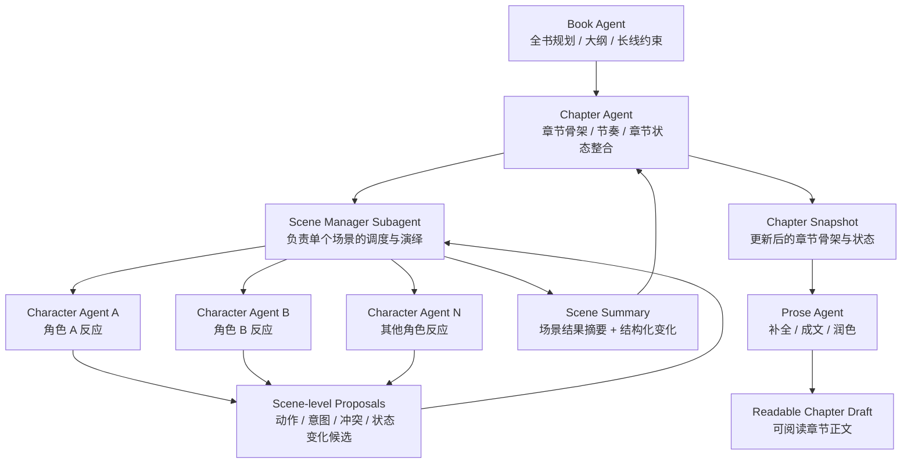
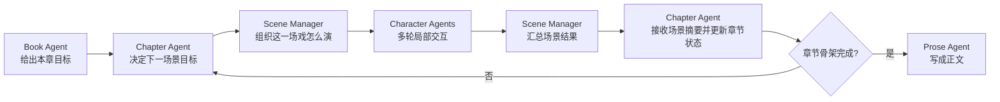

可以，这样层级会更清楚。你现在的章内结构不是 `chapter agent 直接调角色 agent`，而是多了一层 `scene manager subagent` 作为场景导演。

如果看“单次运行循环”，会更像这样：

再压缩成职责划分：

1. `Book Agent` 只管全书级目标，不碰具体场景细节。
2. `Chapter Agent` 只管章节骨架、章节状态和场景级收敛。
3. `Scene Manager Subagent` 负责一场戏内部的多角色调度。
4. `Character Agents` 只从各自视角产出结构化反应。
5. `Prose Agent` 最后才把骨架和场景结果转成正文。

这个版本比前一个更合理，因为 `Chapter Agent` 不会被角色级来回通信淹没，它只跟“场景结果”打交道。

这版图是否已经接近你脑中的分层？